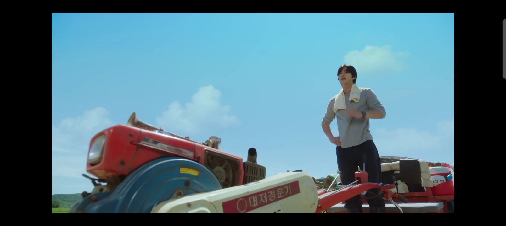
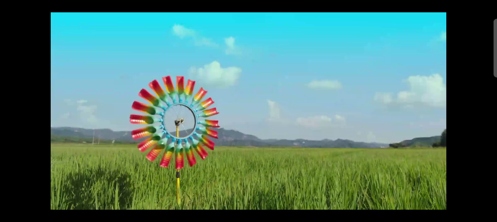
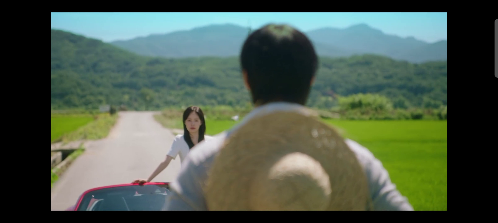
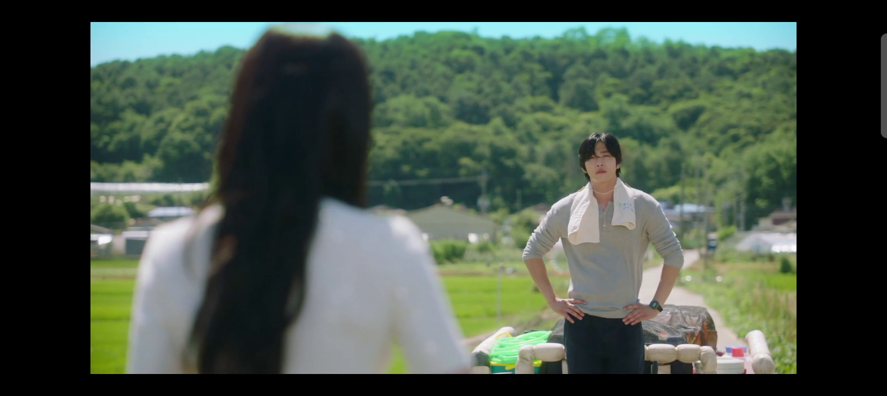
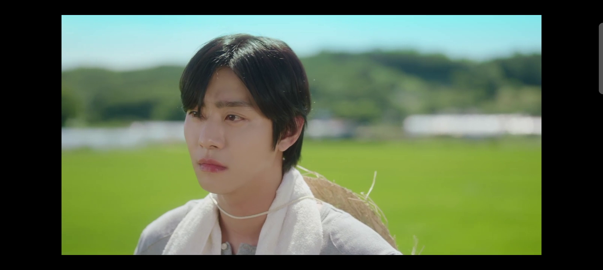
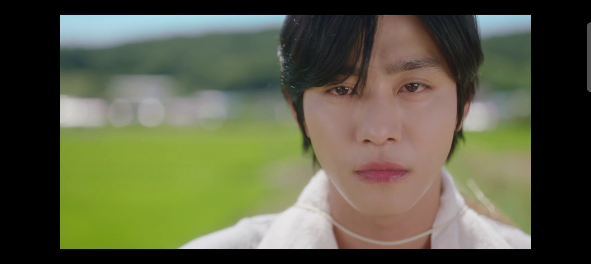
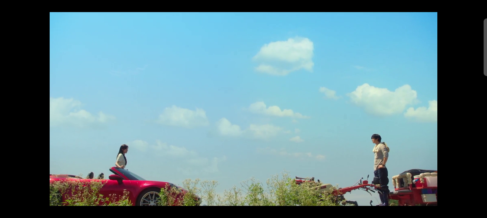

# 视频逆向拉片拆解报告

**参考主题**：乡村小路上的敞篷车都市丽人与手扶拖拉机乡村青年的无声对峙  
**核心美学基调**：治愈而清新的夏日野外乡村风情，交织着隐忍、防备、阶层碰撞与极其克制的无声不舍。

---

### 1. 视听参数解构速查
- **镜头透视**：人文广角大远景低仰拍（大面积蔚蓝天空）与黄金人像焦段（约85mm）极浅景深近景/特写的高保真结合。
- **实体光源**：明媚的夏日正午烈日顶光，在青年的黑发和双肩边缘勾勒出一层耀眼的金色轮廓。
- **主锚点动作**：两人立于道路两端静立对望。青年双手叉腰，神色微动；女子长发与衣摆随野草在夏日微风中轻摇。
- **原生声音公式**：`[风吹过草丛与林木的飒飒物理细节] + [拖拉机发动机熄火后的轻微金属余温声] + [极其微弱而沉重的呼吸声]`
- **截图资产归档**：本地高清关键帧截图已命名并物理归档在同级目录下：
  - `@图片1` -> `./video_frame_1.png`（叉腰伫立）
  - `@图片2` -> `./video_frame_2.png`（稻田风车）
  - `@图片3` -> `./video_frame_3.png`（女子凝视过肩）
  - `@图片4` -> `./video_frame_4.png`（男子防备反打）
  - `@图片5` -> `./video_frame_5.png`（侧颜忧郁近景）
  - `@图片6` -> `./video_frame_6.png`（含泪隐忍特写）
  - `@图片7` -> `./video_frame_7.png`（唯美花丛大远景）

---

### 2. 逆向还原提示词 (直接复制使用)

夏日晴空之下，一辆流线型的明艳红色敞篷跑车与一台布满斑驳红蓝底漆的手扶拖拉机，在一条蜿蜒伸向黛青色群山的乡村柏油路上静静停靠，两人隔着一段距离远远对视。一名黑发微垂的都市女子身穿素雅的白色短袖连衣裙，倚靠在红色敞篷车门侧，神态严肃而带着一丝质问的探寻。在道路另一侧，面容清秀的乡村青年身穿灰色长棉T恤与深色长裤，脖子上搭着白色棉毛巾，草帽绳系在颈前垂于身后，双手叉腰站在拖拉机拖斗上，眼神中交织着倔强、防备与克制的落寞。正午刺眼的炽热阳光直射而下，在青年头顶和肩膀处镀上一圈耀眼的金色轮廓。画面采用大广角低角度仰拍，上方大面积被清澈碧蓝的天空和朵朵白云占满，前景中绿草与白色野花在微风中轻轻摇曳。镜头在极缓慢的呼吸感微弱推进中，进行过肩镜头的正反反打，在两人面部的中近景浅景深特写间平滑切换，背景大面积的翠绿稻田与远山被彻底柔和虚化成斑斓的圆形光斑。最后，青年神色微动，在紧闭双唇的隐忍中，眼眶泛起微弱的泪光，静静地注视着女子，情感无声而深沉地凝聚在乡野的夏日微风里。

---

### 3. 多模态画面细节拆解 (分镜时序快照)

#### 🎥 镜头 1：青年初见 (0.00s)
*   **画面参考 @图片1**：
    
*   **运镜解构**：低仰角定镜头，红色拖拉机车头在左侧前景充当强透视线，右侧青年挺立，勾勒出人物与湛蓝天空交融的硬朗感。

#### 🎥 镜头 2：稻野风车 (5.08s)
*   **画面参考 @图片2**：
    
*   **运镜解构**：全景空镜头，定格在绿意盎然的连绵稻田中。红黄绿三色塑料风车欢快旋转，为故事增添治愈与写意的乡野呼吸感。

#### 🎥 镜头 3：都市丽人的凝视 (10.16s)
*   **画面参考 @图片3**：
    
*   **运镜解构**：经典过肩对角线对峙镜头（O.T.S.），前景为男子虚化的草帽和背影，焦点落在中景站立于红色跑车旁的白色裙装女子，神态专注而若有所思。

#### 🎥 镜头 4：乡村青年的防备 (15.25s)
*   **画面参考 @图片4**：
    
*   **运镜解构**：反打过肩镜头，前景为女子背影长发的模糊轮廓。焦点回锁至站在车尾斗里双手叉腰的青年正脸，夏日顶光勾勒出他面部的明暗层次，神色清冷、对峙。

#### 🎥 镜头 5：侧颜的心理波澜 (20.33s)
*   **画面参考 @图片5**：
    
*   **运镜解构**：黄金人像中近景特写，背景中的绿色麦浪和远山被彻底且斑斓地虚化。男子略微侧头，目光低垂，将人物内心的失落、叹息与挣扎表现得淋漓尽致。

#### 🎥 镜头 6：极致含泪隐忍 (25.43s)
*   **画面参考 @图片6**：
    
*   **运镜解构**：脸部超大特写（E.C.U.）。景深极其狭窄，青年眼眶泛红并闪烁泪光直视前方，嘴唇紧咬。克制和深沉的情感在大屏幕上扑面而来。

#### 🎥 镜头 7：天地画幅里的守望 (30.51s)
*   **画面参考 @图片7**：
    
*   **运镜解构**：极低机位的广角大远景低空仰拍。跑车与拖拉机如同命运的天平两端，对立在随风起伏的白色野草与灌木丛两端。上方湛蓝的巨大天空和白云将所有碰撞包容在乡村的旷野里，完成极具美感的视觉落幅。
